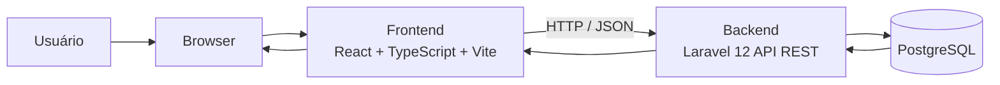
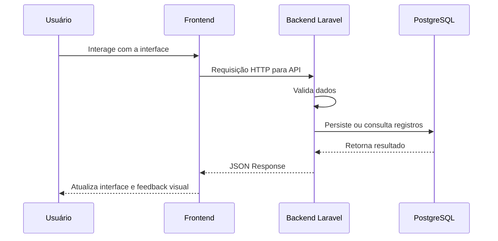
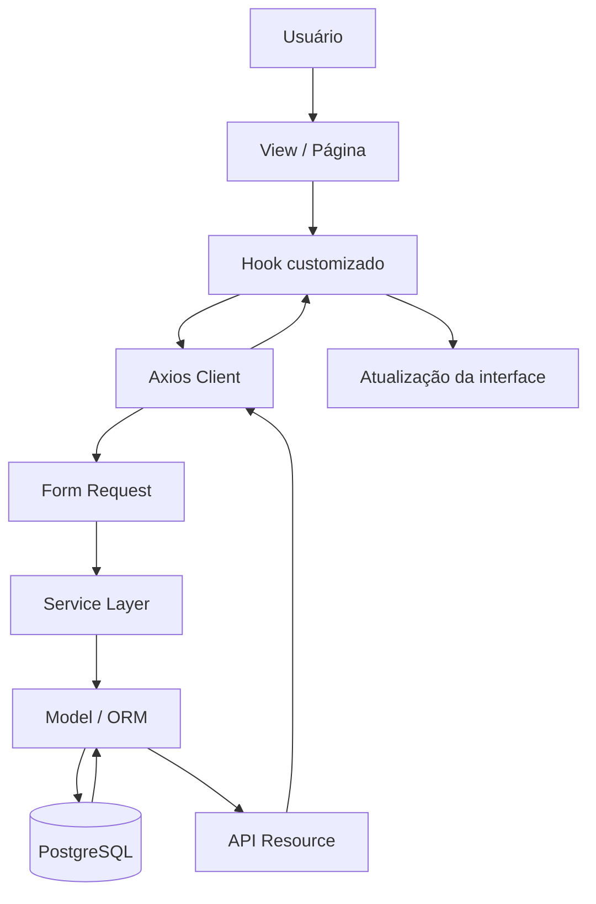
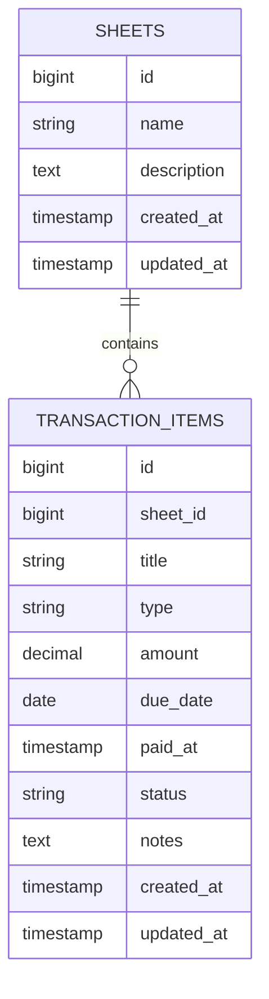
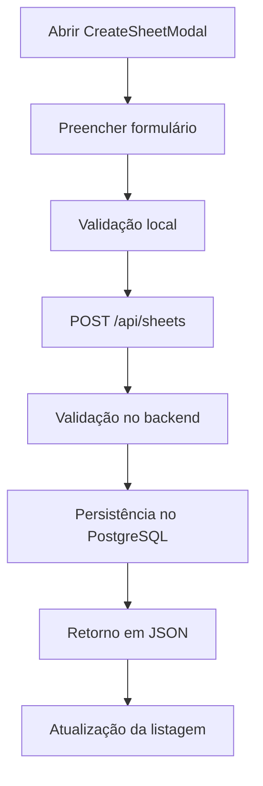
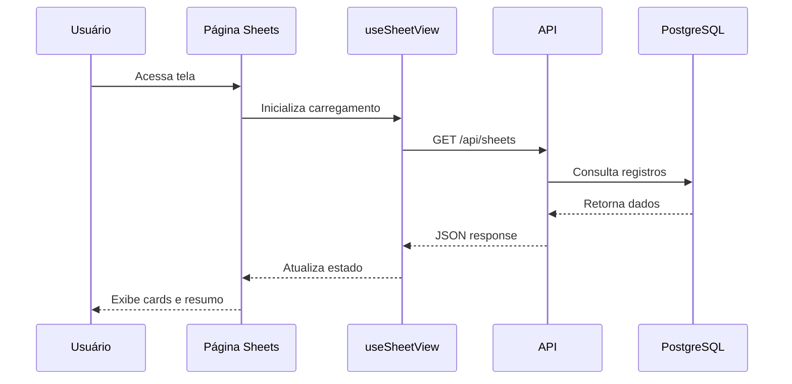
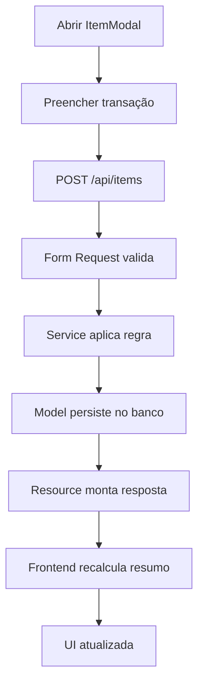
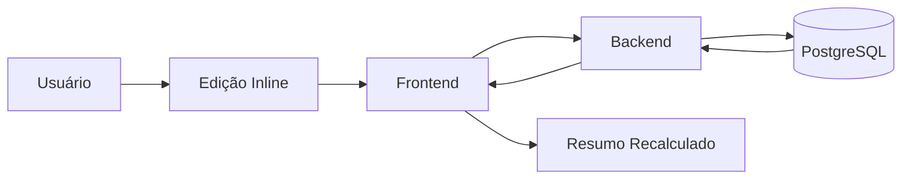
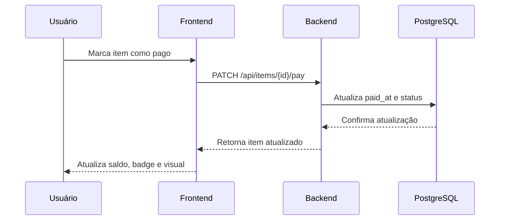

# ClearSheet


---

# 💸 ClearSheet

**ClearSheet** é uma plataforma moderna de **gestão financeira** desenvolvida para proporcionar **clareza**, **organização** e **experiência intuitiva** no controle de entradas, saídas e saldos.

A solução combina um backend robusto em **Laravel 12** com um frontend dinâmico em **React + TypeScript + Vite**, estilizado em **TailwindCSS** e integrado a um banco **PostgreSQL** otimizado para performance.

O sistema adota uma arquitetura **modular**, **headless** e **totalmente desacoplada**, possibilitando evolução contínua, reuso de componentes, manutenção simplificada e escalabilidade consistente.

---

# 📚 Sumário

- [Visão Geral](#-visão-geral)
- [Objetivos do Projeto](#-objetivos-do-projeto)
- [Arquitetura Geral](#-arquitetura-geral)
- [Diagrama de Arquitetura](#-diagrama-de-arquitetura)
- [Fluxo de Comunicação](#-fluxo-de-comunicação)
- [Fluxo de Dados](#-fluxo-de-dados)
- [Stack Tecnológica](#-stack-tecnológica)
- [Estrutura do Projeto](#-estrutura-do-projeto)
- [Estrutura do Backend](#-estrutura-do-backend)
- [Estrutura do Frontend](#-estrutura-do-frontend)
- [Banco de Dados](#-banco-de-dados)
- [Fluxos Funcionais](#-fluxos-funcionais)
- [Experiência do Usuário](#-experiência-do-usuário)
- [Design System](#-design-system)
- [Módulos da Interface](#-módulos-da-interface)
- [Princípios Técnicos](#-princípios-técnicos)
- [Roadmap](#-roadmap)
- [Visão de Futuro](#-visão-de-futuro)
- [Instalação e Setup](#-instalação-e-setup)
- [Execução com Docker](#-execução-com-docker)
- [Variáveis de Ambiente](#-variáveis-de-ambiente)
- [Endpoints Esperados](#-endpoints-esperados)
- [Licença](#-licença)

---

# 🎯 Visão Geral

O ClearSheet foi projetado para ser uma aplicação moderna de controle financeiro com foco em:

- clareza visual
- navegação intuitiva
- componentização forte
- desacoplamento entre UI e regra de negócio
- facilidade de manutenção
- escalabilidade para novas funcionalidades

A aplicação permite organizar informações financeiras de forma prática, com uma base técnica pronta para expansão futura em dashboards, automações, notificações, relatórios e integração com outros produtos.

---

# 🚀 Objetivos do Projeto

O projeto foi concebido com os seguintes objetivos:

- centralizar controle de entradas, saídas e saldo
- fornecer experiência fluida e moderna ao usuário
- manter backend e frontend independentes
- facilitar manutenção e evolução do código
- adotar arquitetura escalável
- permitir reaproveitamento de componentes e regras
- preparar a base para futuras integrações com mobile e dashboards

---

# 🧱 Arquitetura Geral

O ClearSheet é estruturado em dois módulos independentes, comunicando-se exclusivamente via **API REST**:

- **Backend (Laravel 12)** — responsável pela lógica de negócio, validações, regras financeiras, persistência de dados e endpoints REST
- **Frontend (React + TypeScript + Vite)** — responsável pela experiência do usuário, renderização dos dados, interação, feedback visual e componentes dinâmicos

Essa separação garante:

- deploy independente entre frontend e backend
- maior escalabilidade
- melhor legibilidade e organização do projeto
- facilidade para adicionar novos módulos no futuro
- independência para integração com aplicações externas

---

# 🏗️ Diagrama de Arquitetura

```text
┌───────────────────────┐
│        Usuário        │
│   Navegador / WebApp  │
└───────────┬───────────┘
            │
            │ HTTP
            ▼
┌───────────────────────┐
│       Frontend        │
│ React + TS + Vite     │
│ TailwindCSS + Hooks   │
└───────────┬───────────┘
            │
            │ JSON / REST API
            ▼
┌───────────────────────┐
│       Backend         │
│     Laravel 12        │
│ Controllers/Services  │
│ Requests/Resources    │
└───────────┬───────────┘
            │
            │ Eloquent / SQL
            ▼
┌───────────────────────┐
│     PostgreSQL        │
│ Persistência de Dados │
└───────────────────────┘
```

---

# 📊 Diagrama de Arquitetura 


---

# 🔌 Fluxo de Comunicação

O frontend consome apenas rotas REST.

Características principais:

- nenhum acoplamento com Blade
- comunicação exclusivamente em JSON
- arquitetura totalmente headless
- estados gerenciados por hooks e lógica desacoplada
- base preparada para aplicações mobile ou clientes externos

```text
Frontend
   │
   ├── envia requisições HTTP
   │
   ▼
Backend API
   │
   ├── valida dados
   ├── aplica regras financeiras
   ├── consulta banco
   └── retorna JSON
   │
   ▼
Frontend
   │
   ├── interpreta resposta
   ├── atualiza estado
   └── renderiza interface
```

---

# 🔄 Fluxo de Comunicação 



---

# 🧠 Fluxo de Dados

```text
Usuário interage com a tela
        │
        ▼
Frontend dispara ação
        │
        ▼
Hook/processamento local organiza payload
        │
        ▼
Axios envia requisição para API
        │
        ▼
Backend valida request
        │
        ▼
Service aplica regra de negócio
        │
        ▼
Model consulta ou persiste no PostgreSQL
        │
        ▼
Resource formata resposta
        │
        ▼
Frontend atualiza estado e tela
```

---

# 📈 Fluxo de Dados 



---

# ⚙️ Stack Tecnológica

## Backend — Laravel 12

- PHP 8.2+
- Laravel 12
- API REST
- Form Requests para validações robustas
- Eloquent ORM
- Migrations e Seeders
- API Resources para padronização de resposta
- Middleware moderno
- Autenticação via Sanctum ou JWT
- PostgreSQL com índices otimizados

## Frontend — React + TypeScript

- React
- TypeScript
- Vite
- TailwindCSS
- Lucide Icons
- Framer Motion
- Axios
- Hooks customizados
- Context API ou Zustand para gerenciamento de estado

---

# 🧰 Tabela de Tecnologias

| Camada | Tecnologia | Finalidade |
|---|---|---|
| Frontend | React | Construção de interface |
| Frontend | TypeScript | Tipagem e segurança |
| Frontend | Vite | Build e desenvolvimento |
| Frontend | TailwindCSS | Estilização utilitária |
| Frontend | Framer Motion | Microanimações |
| Frontend | Lucide | Ícones |
| Frontend | Axios | Comunicação HTTP |
| Backend | Laravel 12 | Estrutura principal da API |
| Backend | PHP 8.2+ | Linguagem do servidor |
| Backend | Form Requests | Validação |
| Backend | API Resources | Padronização de resposta |
| Banco | PostgreSQL | Persistência de dados |
| DevOps | Docker | Containerização |
| DevOps | Docker Compose | Orquestração de ambientes |

---

# 📁 Estrutura do Projeto

```text
clearsheet/
│
├── backend/
│   ├── app/
│   │   ├── Http/
│   │   │   ├── Controllers/
│   │   │   ├── Requests/
│   │   │   └── Resources/
│   │   ├── Models/
│   │   ├── Services/
│   │   ├── Rules/
│   │   ├── Policies/
│   │   └── Providers/
│   │
│   ├── bootstrap/
│   ├── config/
│   ├── database/
│   │   ├── factories/
│   │   ├── migrations/
│   │   └── seeders/
│   │
│   ├── public/
│   ├── routes/
│   │   ├── api.php
│   │   └── web.php
│   ├── storage/
│   ├── tests/
│   ├── artisan
│   └── composer.json
│
├── frontend/
│   ├── public/
│   ├── src/
│   │   ├── assets/
│   │   ├── components/
│   │   │   ├── common/
│   │   │   ├── sheets/
│   │   │   ├── summary/
│   │   │   ├── transactions/
│   │   │   └── modals/
│   │   ├── hooks/
│   │   ├── pages/
│   │   ├── services/
│   │   ├── store/
│   │   ├── types/
│   │   ├── utils/
│   │   ├── App.tsx
│   │   └── main.tsx
│   │
│   ├── index.html
│   ├── package.json
│   ├── tsconfig.json
│   └── vite.config.ts
│
├── docker/
│   ├── nginx/
│   ├── php/
│   └── postgres/
│
├── docker-compose.yml
└── README.md
```

---

# 🧩 Estrutura do Backend

O backend segue uma organização baseada em responsabilidades bem definidas.

```text
backend/app/
│
├── Http/
│   ├── Controllers/   -> entrada das requisições
│   ├── Requests/      -> validação e sanitização
│   └── Resources/     -> padronização da resposta
│
├── Models/            -> entidades e relacionamento com banco
├── Services/          -> regras de negócio
├── Rules/             -> regras customizadas
├── Policies/          -> autorização
└── Providers/         -> bindings e bootstrap da aplicação
```

### Responsabilidades principais

- **Controllers**: recebem a requisição e delegam responsabilidade
- **Form Requests**: validam dados de entrada
- **Services**: concentram regra de negócio
- **Models**: comunicação com banco via ORM
- **Resources**: serializam resposta da API
- **Policies/Rules**: segurança e consistência

---

# ⚛️ Estrutura do Frontend

O frontend foi pensado para isolar interface, regras locais, tipagens e comunicação com API.

```text
frontend/src/
│
├── components/
│   ├── common/        -> componentes reutilizáveis
│   ├── sheets/        -> componentes da listagem de planilhas
│   ├── summary/       -> cards de resumo financeiro
│   ├── transactions/  -> cards, listas e ações de itens
│   └── modals/        -> modais do sistema
│
├── hooks/             -> lógica desacoplada e reuso
├── pages/             -> telas principais
├── services/          -> cliente HTTP e integrações
├── store/             -> gerenciamento de estado global
├── types/             -> contratos TypeScript
├── utils/             -> helpers e funções auxiliares
├── App.tsx            -> composição principal
└── main.tsx           -> bootstrap da aplicação
```

### Benefícios dessa abordagem

- fácil manutenção
- alta reutilização
- tipagem consistente
- organização por domínio
- separação entre tela e lógica

---

# 🗄️ Banco de Dados

O sistema utiliza **PostgreSQL** como banco relacional principal.

Características esperadas:

- alta confiabilidade
- boa performance
- suporte avançado a índices
- integridade relacional
- consistência de dados financeiros

---

# 🧾 Modelo conceitual de dados

```text
Sheet
 ├── id
 ├── name
 ├── description
 ├── created_at
 └── updated_at

TransactionItem
 ├── id
 ├── sheet_id
 ├── title
 ├── type (income | expense)
 ├── amount
 ├── due_date
 ├── paid_at
 ├── status
 ├── notes
 ├── created_at
 └── updated_at
```

---

# 🗂️ Relacionamento de entidades



---

# 🔥 Fluxos Funcionais

## 1. Fluxo de criação de planilha

```text
Usuário abre modal de criação
        │
        ▼
Preenche nome e informações básicas
        │
        ▼
Frontend valida campos mínimos
        │
        ▼
Requisição POST enviada para API
        │
        ▼
Backend valida request
        │
        ▼
Planilha é salva no PostgreSQL
        │
        ▼
API retorna recurso formatado
        │
        ▼
Frontend fecha modal e atualiza listagem
```

### Mermaid



---

## 2. Fluxo de listagem de planilhas

```text
Tela de planilhas é carregada
        │
        ▼
Hook responsável dispara requisição
        │
        ▼
Backend consulta planilhas
        │
        ▼
Dados retornam em JSON
        │
        ▼
Frontend exibe skeleton enquanto carrega
        │
        ▼
Listagem final é renderizada com cards
```

### Mermaid



---

## 3. Fluxo de criação de transação

```text
Usuário abre modal de item
        │
        ▼
Preenche título, valor, tipo e vencimento
        │
        ▼
Frontend envia dados
        │
        ▼
Backend valida dados financeiros
        │
        ▼
Registro é persistido
        │
        ▼
Resumo financeiro é recalculado
        │
        ▼
Tela é atualizada
```

### Mermaid



---

## 4. Fluxo de edição inline

```text
Usuário altera valor ou informação do item
        │
        ▼
Frontend coloca item em modo de edição
        │
        ▼
Alteração é salva via requisição PATCH/PUT
        │
        ▼
Backend valida e atualiza registro
        │
        ▼
Resumo e status visuais são atualizados
```

### Mermaid



---

## 5. Fluxo de pagamento de item

```text
Usuário aciona popover de pagamento
        │
        ▼
Seleciona data ou confirma pagamento
        │
        ▼
Frontend envia atualização de status
        │
        ▼
Backend persiste paid_at e status
        │
        ▼
Tela destaca item como pago
        │
        ▼
Saldo e totais são recalculados
```

### Mermaid



---

# 🖥️ Experiência do Usuário

O ClearSheet foi projetado com foco em ergonomia e fluidez.

## Listagem de Planilhas

- busca inteligente
- ordenação dinâmica
- skeleton pastel com shimmer
- cards com sparkline duplo
- badges visuais
- microinterações de hover e foco

## Resumo Financeiro

- três cards principais: entradas, saídas e saldo
- cálculo automático
- leitura rápida e objetiva
- visual limpo e arredondado

## Transações

- edição inline otimizada
- tooltips informativos
- botões contextuais
- popover de pagamento
- destaque automático de atrasados

## Modais

- `CreateSheetModal`
- `EditSheetModal`
- `ItemModal`

Características:

- bordas arredondadas
- sombra suave
- animação sutil
- formulários padronizados
- foco em acessibilidade

---

# 🎨 Design System

O ClearSheet adota um estilo visual **Pastel 2026**.

## Características visuais

- paleta soft em tons lilás, azul claro, creme e cinza
- bordas suaves
- `rounded-3xl`
- sombras delicadas
- ícones minimalistas
- forte consistência entre cards, botões e modais
- legibilidade priorizada em todos os estados visuais

## Diretrizes do sistema visual

```text
Paleta Base
- Lilás suave
- Azul claro
- Creme
- Cinza claro
- Tons de apoio para sucesso, alerta e erro

Elementos
- cantos arredondados
- espaçamento respirado
- sombras discretas
- animações naturais
- contraste equilibrado
```

---

# 🧱 Módulos da Interface

Cada módulo possui sua própria estrutura visual e lógica desacoplada.

```text
Módulo Sheets
├── Tela principal
├── Hook de listagem
├── Modal de criação
├── Modal de edição
└── Tipagens específicas

Módulo Summary
├── Cards financeiros
├── Cálculos agregados
└── Componentes de visualização

Módulo Transactions
├── Listagem de itens
├── ItemCard
├── Edição inline
├── Popover de pagamento
└── Estados visuais

Módulo Shared
├── Botões
├── Inputs
├── Tooltips
├── Skeletons
└── Helpers de UI
```

---

# 🧠 Princípios Técnicos

O ClearSheet foi projetado com base nos seguintes princípios:

- **Modularidade** — tudo é isolado por responsabilidade
- **Escalabilidade** — estrutura preparada para crescer
- **Reutilização** — componentes e hooks reaproveitáveis
- **Separação de responsabilidades** — UI, estado, API e regra de negócio em camadas distintas
- **Performance** — renderização suave e carregamento rápido
- **Coesão visual** — consistência entre todas as telas
- **Código limpo** — clareza, padrão e previsibilidade

---

# 🛣️ Roadmap

```markdown
- [ ] Dashboard completo com gráficos
- [ ] Notificações inteligentes
- [ ] Integração OpenFinance
- [ ] Multiusuário com permissões
- [ ] Exportação avançada
- [ ] Importação de planilhas
- [ ] Modo escuro nativo
- [ ] Aplicativo mobile
- [ ] Relatórios por período
- [ ] Categorias financeiras
- [ ] Metas e projeções
```

---

# 🔭 Visão de Futuro

A arquitetura do ClearSheet permite expansão para diversos cenários:

- dashboards analíticos completos
- relatórios gerenciais
- integração com OpenFinance
- multiusuário e times
- permissões por perfil
- exportação em formatos diversos
- aplicação mobile compartilhando a mesma API
- automações financeiras
- notificações e lembretes inteligentes

---

# 🚀 Instalação e Setup

## Pré-requisitos

```text
- PHP 8.2+
- Composer
- Node.js 20+
- NPM ou PNPM
- PostgreSQL
- Docker e Docker Compose (opcional)
```

---

## Backend

```bash
cd backend
cp .env.example .env
composer install
php artisan key:generate
php artisan migrate --seed
php artisan serve
```

Backend disponível em:

```text
http://localhost:8000
```

---

## Frontend

```bash
cd frontend
cp .env.example .env
npm install
npm run dev
```

Frontend disponível em:

```text
http://localhost:5173
```

---

# 🐳 Execução com Docker

```bash
docker-compose up -d --build
```

Exemplo de arquitetura em container:

```text
┌────────────┐      JSON REST       ┌──────────────┐
│  Frontend  │  <---------------->  │   Backend    │
│ React + TS │                      │ Laravel 12   │
└────────────┘                      └──────┬───────┘
                                           │
                                           ▼
                                      PostgreSQL
```

---

# 🧪 Variáveis de Ambiente

## Backend `.env`

```env
APP_NAME=ClearSheet
APP_ENV=local
APP_KEY=
APP_DEBUG=true
APP_URL=http://localhost:8000

DB_CONNECTION=pgsql
DB_HOST=127.0.0.1
DB_PORT=5432
DB_DATABASE=clearsheet
DB_USERNAME=postgres
DB_PASSWORD=postgres
```

## Frontend `.env`

```env
VITE_API_URL=http://localhost:8000/api
```

---

# 🌐 Endpoints Esperados

```text
GET    /api/sheets
POST   /api/sheets
GET    /api/sheets/{id}
PUT    /api/sheets/{id}
DELETE /api/sheets/{id}

GET    /api/sheets/{id}/items
POST   /api/items
PUT    /api/items/{id}
PATCH  /api/items/{id}/pay
DELETE /api/items/{id}
```

---

# 📦 Exemplo de resposta JSON

```json
{
  "data": {
    "id": 1,
    "name": "Planilha Janeiro",
    "description": "Controle mensal",
    "totals": {
      "income": 4200.50,
      "expense": 1780.30,
      "balance": 2420.20
    },
    "items": [
      {
        "id": 10,
        "title": "Salário",
        "type": "income",
        "amount": 4200.50,
        "status": "paid"
      },
      {
        "id": 11,
        "title": "Aluguel",
        "type": "expense",
        "amount": 1200.00,
        "status": "pending"
      }
    ]
  }
}
```

---

# ✅ Diferenciais Técnicos

- arquitetura totalmente headless
- separação real entre frontend e backend
- API pronta para integração externa
- componentes reutilizáveis
- hooks desacoplados
- design system consistente
- tipagem robusta
- backend escalável em Laravel 12
- base pronta para futuras expansões
- estrutura adequada para produto real

---

# 📄 Licença

Este projeto está sob a licença **MIT**.

```text
MIT License

Copyright (c) Matheus Diamantino

Permission is hereby granted, free of charge, to any person obtaining a copy
of this software and associated documentation files, to deal in the Software
without restriction, including without limitation the rights to use, copy,
modify, merge, publish, distribute, sublicense, and/or sell copies.
```

---

# 👨‍💻 Autor

**Matheus Diamantino**

- GitHub: `https://github.com/Henri-Di`
- LinkedIn: `https://www.linkedin.com/in/matheus-diamantino-952b3121a/`

---

# ✨ Considerações Finais

O ClearSheet representa uma proposta moderna de aplicação financeira, construída com foco em arquitetura limpa, UI bem planejada e base técnica sólida para evolução contínua.

Ele não é apenas uma interface bonita, mas uma fundação preparada para se transformar em um produto completo, escalável e profissional.
